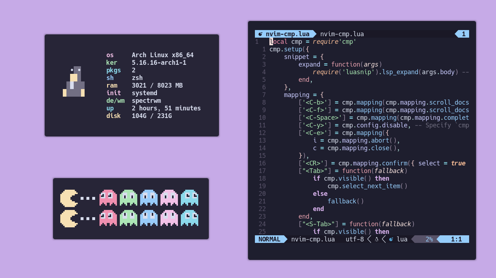

<h3 align="center">
	 
	
	Catppuccin for <a href="https://docs.xfce.org/apps/xfce4-terminal/start">XFCE4-Terminal</a>
	
</h3>

    
    
    

## Usage

1. Copy selected flavour file from `src` folder to `~/.local/share/xfce4/terminal/colorschemes` (create folder if doesn't exist).
2. Open XFCE4-terminal and go to `Preferences → Colors → Presets`.
3. Choose flavour in the drop-down.

## 💝 Thanks to

- [pacbru1260](https://github.com/pacbru1260)
- [Sanjay Pavan](https://github.com/WitherCubes)
- [elkrien](https://github.com/elkrien)
- [extremepayne](https://github.com/extremepayne)

&nbsp;

Copyright &copy; 2021-present <a href="https://github.com/catppuccin" target="_blank">Catppuccin Org</a>

